<div align="center">

<a href="https://envoapi.com/mcp">
  <picture>
    <source media="(prefers-color-scheme: dark)" srcset="assets/logo-dark.svg">
    
  </picture>
</a>

# LinkedIn Data MCP Server

**Look up people, companies, jobs and posts from the AI assistant you already use.**<br>
One hosted [LinkedIn MCP server](https://envoapi.com/mcp) for Claude, ChatGPT, Perplexity, Cursor, Claude Code, Codex and any other MCP client.

[](https://docs.envoapi.com/guides/mcp/)
[](#-whats-inside-40-tools)
[](#-quick-start)
[](https://envoapi.com/signup)

[Website](https://envoapi.com/mcp) · [Docs](https://docs.envoapi.com/guides/mcp/) · [Get API key](https://envoapi.com/signup) · [Pricing](https://envoapi.com/pricing) · [Status](https://status.envoapi.com)

<br>



</div>

<br>

## ⚡ Quick start

**1. Get your API key.** Create a free account at **[envoapi.com/signup](https://envoapi.com/signup)**. You get 100 free credits, and no card is needed. Your keys live at [Dashboard → API keys](https://envoapi.com/dashboard/keys).

**2. Add the server to your client.** Use this one URL everywhere:

```text
https://api.envoapi.com/mcp
```

**3. Ask in plain words.** For example: *"Find the VP of Sales at Northstar Systems and summarize their background."* The assistant picks the right tools.

| | |
|---|---|
| **Server URL** | `https://api.envoapi.com/mcp` |
| **Transport** | Streamable HTTP (remote, nothing to install) |
| **Auth** | OAuth sign-in in the browser, **or** the header `Authorization: Bearer <ENVO_API_KEY>` |
| **Data** | Public profile, company, job and post data from the [EnvoAPI LinkedIn Data API](https://envoapi.com/linkedin-data-api) |
| **Tools** | 40, all read-only |
| **Cost** | No MCP fee. Calls use the same credits as the [REST API](https://docs.envoapi.com/api/). |

> [!TIP]
> **OAuth or API key?** Clients with sign-in support (Claude, ChatGPT, Perplexity, Claude Code, Codex, Cursor, VS Code and others) open a browser window. You sign in to EnvoAPI and approve, and no key is stored. Use your **API key** for clients without OAuth, for servers and for CI jobs.

<br>

## 🔌 Connect your client

**One-click install**

[](https://claude.ai/new?modal=add-custom-connector#customize/connectors)
[](https://chatgpt.com/plugins)
[](https://cursor.com/en/install-mcp?name=envoapi&config=eyJ1cmwiOiJodHRwczovL2FwaS5lbnZvYXBpLmNvbS9tY3AifQ%3D%3D)
[](https://insiders.vscode.dev/redirect/mcp/install?name=envoapi&config=%7B%22type%22%3A%22http%22%2C%22url%22%3A%22https%3A%2F%2Fapi.envoapi.com%2Fmcp%22%7D)
[](https://insiders.vscode.dev/redirect/mcp/install?name=envoapi&config=%7B%22type%22%3A%22http%22%2C%22url%22%3A%22https%3A%2F%2Fapi.envoapi.com%2Fmcp%22%7D&quality=insiders)

**Step-by-step.** Click your client to expand it.

### Chat apps

<details>
<summary><b>Claude</b> (web, desktop and mobile)</summary>

<br>

1. Open **Customize → Connectors → + → Add custom connector**, or use [this direct link](https://claude.ai/new?modal=add-custom-connector#customize/connectors).
2. Enter these values, then click **Add**:
   - **Name:** `EnvoAPI`
   - **Remote MCP server URL:** `https://api.envoapi.com/mcp`
3. Claude sends you to EnvoAPI. Sign in and approve the connector.
4. In a chat, open **+ → Connectors** and switch **EnvoAPI** on.

Connectors you add on the web also appear in the desktop and mobile apps. On Team and Enterprise plans, an owner may need to add the connector for the organization first.

</details>

<details>
<summary><b>Claude Desktop</b> with an API key (no OAuth)</summary>

<br>

Use this only if you can't use the connector flow above. It needs **Node.js 18+**, because Claude Desktop reaches the server through the [`mcp-remote`](https://www.npmjs.com/package/mcp-remote) bridge.

Open **Settings → Developer → Edit Config** and add:

```json
{
  "mcpServers": {
    "envoapi": {
      "command": "npx",
      "args": [
        "-y",
        "mcp-remote",
        "https://api.envoapi.com/mcp",
        "--header",
        "Authorization:${ENVO_AUTH_HEADER}"
      ],
      "env": {
        "ENVO_AUTH_HEADER": "Bearer YOUR_ENVO_API_KEY"
      }
    }
  }
}
```

The config file lives at `~/Library/Application Support/Claude/claude_desktop_config.json` on macOS and `%APPDATA%\Claude\claude_desktop_config.json` on Windows. Restart Claude Desktop afterwards.

</details>

<details>
<summary><b>ChatGPT</b></summary>

<br>

1. **Turn on developer mode** once per account: **Settings → Security and login → Developer mode**. The *Create MCP App* option stays hidden until you do.
2. Open [ChatGPT plugins](https://chatgpt.com/plugins) and choose **Add → Create MCP App**.
3. Fill in the form:
   - **Name:** `EnvoAPI`
   - **Connection:** `https://api.envoapi.com/mcp`
   - **Authentication:** `OAuth`
4. Tick **I understand and want to continue**, then click **Create**.
5. Sign in to EnvoAPI, approve access, and enable **EnvoAPI** in your conversation.

</details>

<details>
<summary><b>Perplexity</b></summary>

<br>

Custom remote connectors are available on Perplexity's paid plans, on web and desktop.

1. Open **Settings → Connectors** and click **+ Custom connector**, then choose **Remote**.
2. Fill in the form:
   - **Name:** `EnvoAPI`
   - **MCP server URL:** `https://api.envoapi.com/mcp`
   - **Authentication:** `OAuth`
   - **Transport:** `Streamable HTTP`
3. Accept the notice and save. Then click the **EnvoAPI** card to sign in and approve.
4. In a thread, open **+ → Connectors and sources** and tick **EnvoAPI**.

On Enterprise, an admin may need to turn on *Allow members to add custom connectors* first.

</details>

### Coding agents and CLIs

<details>
<summary><b>Claude Code</b></summary>

<br>

```bash
claude mcp add --transport http envoapi https://api.envoapi.com/mcp
```

Start Claude Code, run `/mcp`, select **envoapi** and approve in your browser. Check it with `claude mcp list`. The tools appear as `mcp__envoapi__*`.

**With an API key:**

```bash
claude mcp add --transport http envoapi https://api.envoapi.com/mcp \
  --header "Authorization: Bearer $ENVO_API_KEY"
```

Add `--scope user` to make EnvoAPI available in every project.

</details>

<details>
<summary><b>Codex</b> (CLI, IDE extension and app)</summary>

<br>

```bash
codex mcp add envoapi --url https://api.envoapi.com/mcp
codex mcp login envoapi
```

Approve in the browser, then run `/mcp` in Codex to check the connection.

**With an API key**, add this to `~/.codex/config.toml` and export `ENVO_API_KEY` in your shell:

```toml
[mcp_servers.envoapi]
url = "https://api.envoapi.com/mcp"
bearer_token_env_var = "ENVO_API_KEY"
```

</details>

<details>
<summary><b>Gemini CLI</b></summary>

<br>

```bash
gemini mcp add --transport http envoapi https://api.envoapi.com/mcp
```

Then, inside Gemini CLI, run `/mcp auth envoapi` to sign in.

**With an API key**, use `~/.gemini/settings.json`:

```json
{
  "mcpServers": {
    "envoapi": {
      "httpUrl": "https://api.envoapi.com/mcp",
      "headers": {
        "Authorization": "Bearer $ENVO_API_KEY"
      }
    }
  }
}
```

</details>

<details>
<summary><b>OpenCode</b></summary>

<br>

Add this to `opencode.json` in your project, or to `~/.config/opencode/opencode.json` for all projects:

```json
{
  "$schema": "https://opencode.ai/config.json",
  "mcp": {
    "envoapi": {
      "type": "remote",
      "url": "https://api.envoapi.com/mcp",
      "enabled": true
    }
  }
}
```

Sign-in opens on the first tool call. If it doesn't, run `opencode mcp auth envoapi`, then check with `opencode mcp list`.

**With an API key**, add `"headers": { "Authorization": "Bearer {env:ENVO_API_KEY}" }` to the `envoapi` entry.

</details>

### Editors

<details>
<summary><b>Cursor</b></summary>

<br>

**[Click to install](https://cursor.com/en/install-mcp?name=envoapi&config=eyJ1cmwiOiJodHRwczovL2FwaS5lbnZvYXBpLmNvbS9tY3AifQ%3D%3D)**, or merge this into `~/.cursor/mcp.json` (global) or `.cursor/mcp.json` (project):

```json
{
  "mcpServers": {
    "envoapi": {
      "url": "https://api.envoapi.com/mcp"
    }
  }
}
```

Enable **envoapi** in Cursor's MCP settings and sign in when prompted.

**With an API key:**

```json
{
  "mcpServers": {
    "envoapi": {
      "url": "https://api.envoapi.com/mcp",
      "headers": {
        "Authorization": "Bearer ${env:ENVO_API_KEY}"
      }
    }
  }
}
```

</details>

<details>
<summary><b>VS Code</b> (GitHub Copilot agent mode)</summary>

<br>

**[Click to install](https://insiders.vscode.dev/redirect/mcp/install?name=envoapi&config=%7B%22type%22%3A%22http%22%2C%22url%22%3A%22https%3A%2F%2Fapi.envoapi.com%2Fmcp%22%7D)**, run

```bash
code --add-mcp '{"name":"envoapi","type":"http","url":"https://api.envoapi.com/mcp"}'
```

or merge this into `.vscode/mcp.json`:

```json
{
  "servers": {
    "envoapi": {
      "type": "http",
      "url": "https://api.envoapi.com/mcp"
    }
  }
}
```

Run **MCP: List Servers** from the Command Palette, start **envoapi** and sign in.

**With an API key.** VS Code prompts for the key once and stores it securely:

```json
{
  "inputs": [
    { "type": "promptString", "id": "envo-api-key", "description": "EnvoAPI API key", "password": true }
  ],
  "servers": {
    "envoapi": {
      "type": "http",
      "url": "https://api.envoapi.com/mcp",
      "headers": { "Authorization": "Bearer ${input:envo-api-key}" }
    }
  }
}
```

</details>

<details>
<summary><b>Windsurf</b></summary>

<br>

Add this to `~/.codeium/windsurf/mcp_config.json`, then click **Refresh** in the MCP panel:

```json
{
  "mcpServers": {
    "envoapi": {
      "serverUrl": "https://api.envoapi.com/mcp"
    }
  }
}
```

**With an API key**, add `"headers": { "Authorization": "Bearer ${env:ENVO_API_KEY}" }` next to `serverUrl`.

</details>

<details>
<summary><b>Zed</b></summary>

<br>

Add this to your Zed `settings.json`. Zed starts the OAuth sign-in when no `Authorization` header is set:

```json
{
  "context_servers": {
    "envoapi": {
      "url": "https://api.envoapi.com/mcp"
    }
  }
}
```

**With an API key**, add `"headers": { "Authorization": "Bearer YOUR_ENVO_API_KEY" }`.

</details>

<details>
<summary><b>Cline</b></summary>

<br>

Open Cline's **MCP Servers** panel, choose **Configure MCP Servers** and add:

```json
{
  "mcpServers": {
    "envoapi": {
      "type": "streamableHttp",
      "url": "https://api.envoapi.com/mcp",
      "headers": {
        "Authorization": "Bearer YOUR_ENVO_API_KEY"
      }
    }
  }
}
```

</details>

### Local apps and automation

<details>
<summary><b>LM Studio</b></summary>

<br>

Open the **Program** tab in the right sidebar, choose **Install → Edit mcp.json** and add:

```json
{
  "mcpServers": {
    "envoapi": {
      "url": "https://api.envoapi.com/mcp",
      "headers": {
        "Authorization": "Bearer YOUR_ENVO_API_KEY"
      }
    }
  }
}
```

</details>

<details>
<summary><b>n8n</b> (AI Agent node)</summary>

<br>

1. In your **AI Agent** node, add the tool **MCP Client Tool**.
2. Set **Endpoint** to `https://api.envoapi.com/mcp` and **Server Transport** to `HTTP Streamable`.
3. Set **Authentication** to `Bearer Auth` and create a credential with your EnvoAPI API key.
4. Under **Tools to Include**, pick *All* or just the tools your workflow needs.

</details>

<details>
<summary><b>Any other MCP client</b></summary>

<br>

Add `https://api.envoapi.com/mcp` as a **remote** server over **Streamable HTTP**.

- If the client supports OAuth, leave auth empty and it will open the EnvoAPI sign-in.
- If it doesn't, send the header `Authorization: Bearer <ENVO_API_KEY>`.
- For a client that only supports local (stdio) servers, bridge it with `npx -y mcp-remote https://api.envoapi.com/mcp --header "Authorization:Bearer <ENVO_API_KEY>"`.

</details>

<br>

## 💬 Try these prompts

| Goal | Ask your assistant |
|---|---|
| Find a decision maker | *"Find the VP of Sales at Northstar Systems and summarize their background."* |
| Prep for a call | *"Brief me on Northstar Systems: size, HQ, open roles and recent posts."* |
| Track hiring | *"Show me the jobs Northstar Systems has open right now, grouped by team."* |
| Map a market | *"List 10 companies similar to Northstar Systems with headcount and HQ."* |
| Read the room | *"Summarize the comments on this post and group them by theme: `<post URL>`"* |
| Reach out | *"Find the work email for Northstar's Head of Marketing and verify it."* |
| Enrich a list | *"Enrich every LinkedIn URL in `leads.csv` with job title and current company."* (agents with file access) |

<br>

## 🧰 What's inside: 40 tools

All tools are **read-only**. They can't post, message, connect or change anything.

| Group | Tools |
|---|---|
| **Profiles** (13) | `get_profile_details` · `get_profile_contact` · `get_profile_full_experience` · `get_profile_education` · `get_profile_skills` · `get_profile_certifications` · `get_profile_courses` · `get_profile_company_interests` · `get_profile_volunteer_experience` · `get_profile_posts` · `get_profile_comments` · `get_profile_reactions` · `get_similar_profiles` |
| **Companies** (6) | `get_company_details` · `get_company_people` · `get_company_posts` · `get_company_products` · `get_company_jobs` · `get_similar_companies` |
| **Search** (11) | `search_people_by_keyword` · `search_companies_by_domain` · `search_companies_by_keyword` · `search_schools_by_keyword` · `search_all_results_by_keyword` · `search_posts_by_hashtag` · `search_posts_by_keyword` · `search_locations_by_keyword` · `search_industries_by_keyword` · `search_service_categories` · `get_search_typeahead` |
| **Jobs** (2) | `search_jobs` · `get_job_details` |
| **Posts** (3) | `get_post` · `get_post_comments` · `get_post_reactions` |
| **Emails** (2) | `find_email` · `verify_email` |
| **Websites** (3) | `get_website_content` · `get_website_text` · `search_website_emails` |

Each call returns **one page** of results. People search, combined search and hashtag post search return 3 per page. Most other lists return 10. Ask for "the next page" to keep going.

Need the same data in your own code? See the [LinkedIn Profile API](https://envoapi.com/linkedin-profile-api), [LinkedIn Company Data API](https://envoapi.com/linkedin-company-data-api) and [LinkedIn Jobs API](https://envoapi.com/linkedin-jobs-api).

<br>

## 💳 Credits

There's no separate MCP fee. Calls use your plan's credits and rate limits, the same as the REST API.

| Lookup | Example tools | Credits per call |
|---|---|:-:|
| Profile, company, post, job, search | `get_profile_details`, `search_jobs` | **1** |
| Profile contact | `get_profile_contact` | **2** |
| Verify an email | `verify_email` | **2** |
| Read a web page | `get_website_content`, `get_website_text` | **2** |
| Collect a site's emails | `search_website_emails` | **5** |
| Find a work email | `find_email` | **10** |

- Bad input is rejected **before** any credits are taken.
- Failures caused by EnvoAPI or its providers are **refunded**.
- Finished contact, email-finder and website-email lookups are charged even when they return nothing.

New accounts get **100 free credits**. See [pricing](https://envoapi.com/pricing) for paid plans.

<br>

## 🔒 Security and access

- **OAuth connections:** open the [MCP page in your dashboard](https://envoapi.com/dashboard/mcp), find **Connected clients** and choose **Disconnect**. Access stops right away.
- **API keys:** revoke a key in [Dashboard → API keys](https://envoapi.com/dashboard/keys). This stops every client that uses it.
- Keep keys in your client's settings or environment variables. Never paste them into a chat or commit them to source control.
- One API key works for both MCP and the REST API, with the same credits.

<br>

## 🩺 Troubleshooting

| Problem | Fix |
|---|---|
| No sign-in prompt appears | Check the URL is exactly `https://api.envoapi.com/mcp`. If your client can't do OAuth but supports custom headers, use your API key. |
| `401` / "access credential is missing or invalid" | Re-run the sign-in (`/mcp` in Claude Code, `codex mcp login envoapi`, `opencode mcp auth envoapi`), or check the `Bearer` key. |
| Tools are missing or never used | Enable EnvoAPI for the conversation, refresh the client's tool list, or reconnect. Mention "use EnvoAPI" in your prompt. |
| A lookup failed | Check your account status and available credits. If you hit the rate limit, wait and retry. See the [docs](https://docs.envoapi.com/). |
| ChatGPT has no *Create MCP App* | Turn on **Developer mode** first (Settings → Security and login). |

<br>

## ❓ FAQ

<details>
<summary><b>What's the difference between EnvoAPI MCP and the REST API?</b></summary>

They return the same data at the same prices. MCP suits lookups from chat and editors. The [REST API](https://docs.envoapi.com/api/) and the [SDKs](https://github.com/envoapi-official/envoapi-sdks) for Python, TypeScript and Go suit scheduled jobs, bulk work and product code. For a side-by-side guide, read [MCP vs REST API for B2B data enrichment](https://envoapi.com/blog/mcp-vs-rest-api-b2b-data-enrichment).

</details>

<details>
<summary><b>Is this the official LinkedIn API?</b></summary>

No. EnvoAPI is an independent service that returns public LinkedIn data. You sign in to EnvoAPI, not to LinkedIn, so you never connect your own LinkedIn account. Read [LinkedIn API: official vs unofficial](https://envoapi.com/blog/linkedin-api-official-vs-unofficial) to see how the options compare.

</details>

<details>
<summary><b>Do I need an API key if I use OAuth?</b></summary>

No. OAuth clients only need an EnvoAPI account. You sign in once and approve. The API key is for clients that can't do OAuth.

</details>

<details>
<summary><b>Does the email finder work for Gmail or Yahoo addresses?</b></summary>

It works on company domains. Yahoo-family addresses can't be checked, so those calls are refunded. Catch-all domains are charged but return no address.

</details>

<details>
<summary><b>Can it post, message or change anything?</b></summary>

No. All 40 tools are read-only.

</details>

<br>

## 📚 About EnvoAPI

[EnvoAPI](https://envoapi.com) is a real-time [data enrichment API for people and companies](https://envoapi.com/data-enrichment-api). The MCP server, the REST API and the SDKs share one account and one credit balance.

- [MCP server for B2B data enrichment in AI sales workflows](https://envoapi.com/blog/mcp-server-b2b-data-enrichment)
- [How to migrate from Proxycurl to EnvoAPI](https://envoapi.com/blog/migrating-from-proxycurl)

<br>

---

<div align="center">

**[Get your API key →](https://envoapi.com/signup)**

<sub>EnvoAPI is an independent service. It is not affiliated with, endorsed by or sponsored by LinkedIn Corporation. LinkedIn is a trademark of LinkedIn Corporation. Use the data in line with applicable laws and the <a href="https://envoapi.com/terms">EnvoAPI terms</a>.</sub>

</div>
